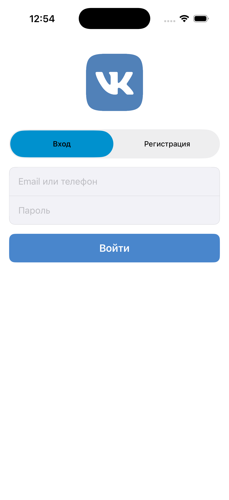
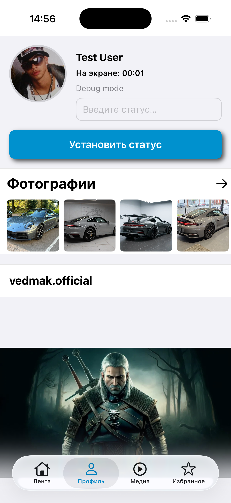
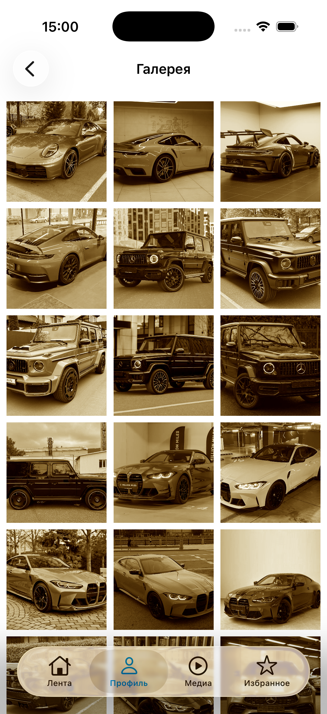
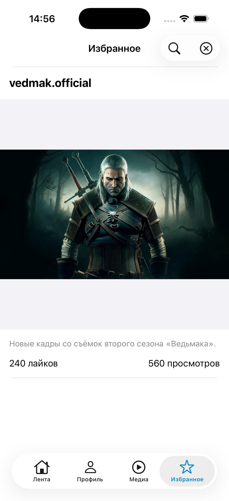
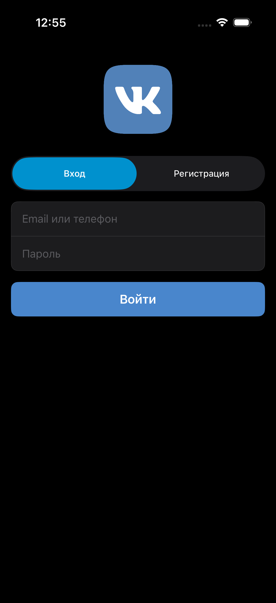
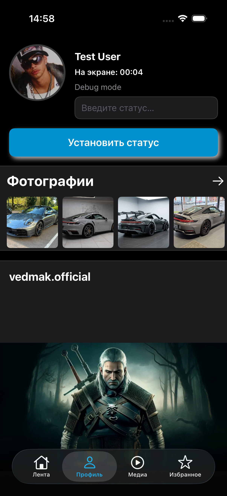
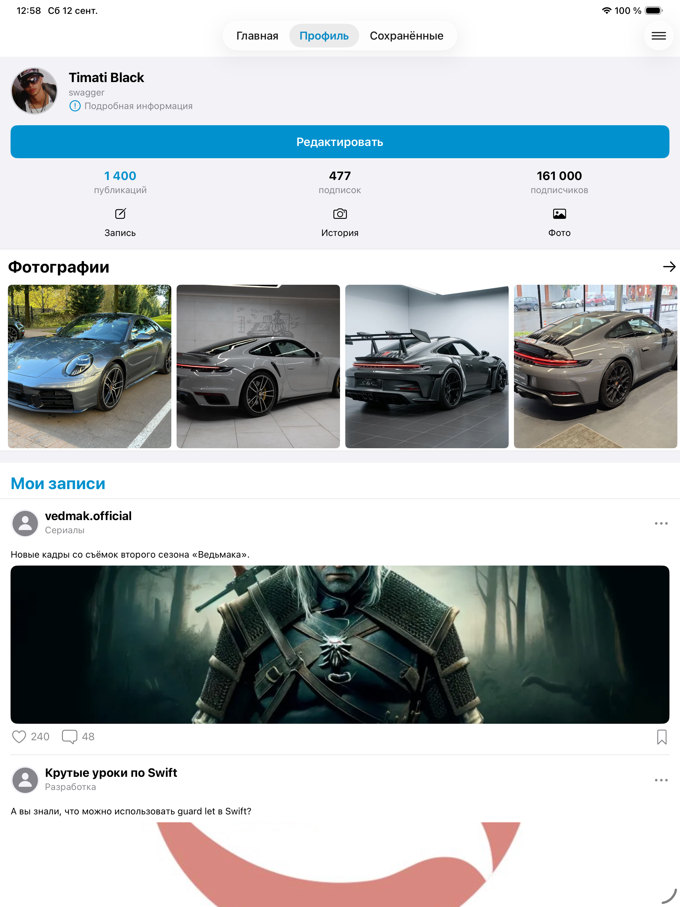
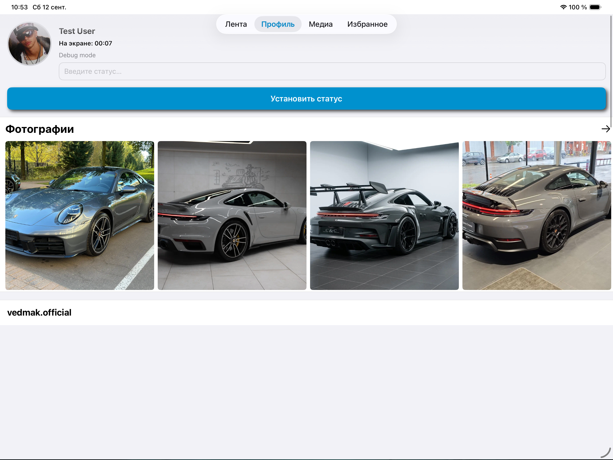

# Navigation — клиент социальной сети

Учебный проект для профессии «iOS-разработчик». Приложение воспроизводит
основные сценарии мобильного клиента социальной сети: авторизация, лента,
профиль с постами и фотогалереей и избранное. Добавлен также функционал редактирования профиля и выхода из учетной записи.

## Скриншоты

| Вход | Профиль | Галерея | Избранное |
|---|---|---|---|
|  |  |  |  |

### Тёмная тема

| Вход | Профиль |
|---|---|
|  |  |

### iPad

| Портрет | Ландшафт |
|---|---|
|  |  |


## Возможности

- **Авторизация** через Firebase Authentication по email и паролю.
  Незнакомый email регистрируется автоматически.
- **Вход по биометрии** (Face ID / Touch ID) с обработкой всех состояний `LAError`.
- **Лента** со всеми постами.
- **Профиль**: шапка с аватаром, редактируемый статус, таймер времени
  на экране, лента постов, превью фотогалереи.
- **Анимация аватара**: разворот на весь экран по тапу с затемнением фона.
- **Галерея** из 20 фотографий с фильтром «сепия» в фоновом потоке.
- **Drag & Drop** постов внутри профиля.
- **Избранное** на Core Data: двойной тап сохраняет, свайп удаляет,
  фильтрация по автору через `NSFetchedResultsController`.
- **Локальные уведомления** с категорией и кнопкой действия.
- **Тёмная тема** и **локализация** (русский, английский).
- **Поддержка iPad**, включая Split View и обе ориентации.

## Архитектура

### MVVM + Coordinator

```
View (UIViewController)
  │  updateState(viewInput:)      — действия пользователя
  ↑  onStateDidChange             — обновления состояния
ViewModel
  │  вызывает сервисы             — бизнес-логика
  │  вызывает координатор         — навигация
Service (протокол)
```

- **View** не знает ни о сервисах, ни о навигации. Только рисует состояние.
- **ViewModel** держит состояние (`enum State`), принимает действия
  (`enum ViewInput`), уведомляет View через `onStateDidChange`.
  Общий контракт — `ViewModelProtocol`.
- **Coordinator** отвечает за навигацию. `AppCoordinator` собирает таб-бар
  и запускает `FeedCoordinator`, `ProfileCoordinator`, `MediaCoordinator`,
  `FavouritesCoordinator`.
- **Service** — бизнес-логика и работа с внешним миром за протоколами.

### Внедрение зависимостей

- `ServiceContainer` создаёт все сервисы лениво и отдаёт за протоколами.
- `ModuleFactory` собирает модули: создаёт ViewModel с нужными сервисами
  и внедряет её во ViewController через инициализатор.
- Координаторы просят фабрику собрать модуль и не знают о его устройстве.
- **Синглтонов в проекте нет** — любой сервис подменяется моком в тестах.

### Структура

```
Navigation/
├── Architecture/       ViewModelProtocol
├── Coordinators/       App, Feed, Profile, Media, Favourites
├── CustomViews/        CustomButton
├── DI/                 ServiceContainer, ModuleFactory
├── Extensions/         Reusable, UIImage+Alpha, UIView+AdaptiveWidth
├── Models/             User, PostModel, FavouritePost, BiometryType
├── Profile/            Login, Profile, Photos, Favourites (View + ViewModel)
├── Resources/
│   ├── Appearance/     AppColor, AppFont, AppLayout — стайлгайд
│   ├── L10n.swift
│   └── Localizable.xcstrings
└── Services/           Feed, Post, Photo, Favourites, Network, CoreData,
                        LocalAuthorization, LocalNotification, Checker
```

### Стайлгайд

Цвета, шрифты и отступы собраны в трёх enum'ах в `Resources/Appearance/`.
В UI-коде нет ни одного литерала цвета, шрифта или отступа — только
`AppColor.primaryText`, `AppFont.postAuthor`, `AppLayout.spacing`.
Цвета динамические, шрифты обёрнуты в `UIFontMetrics` и реагируют
на системную настройку размера текста.

## Технологии

| | |
|---|---|
| Язык | Swift 5 |
| Минимальная версия | iOS 16.0 |
| Вёрстка | Auto Layout, программно, без storyboard |
| Архитектура | MVVM + Coordinator, DI через контейнер и фабрику |
| Хранилище | Core Data (`NSFetchedResultsController`, in-memory для тестов) |
| Авторизация | Firebase Auth, LocalAuthentication |
| Медиа | AVFoundation, AVAudioRecorder, WKWebView |
| Многопоточность | GCD, `iOSIntPackage.ImageProcessor` |
| Зависимости | CocoaPods (Firebase, SwiftLint), SPM (iOSIntPackage) |
| Тесты | XCTest, in-memory Core Data, моки на протоколах |
| Стиль кода | SwiftLint (0 предупреждений) |

## Сборка

```bash
git clone git@github.com:Dglasmann/ios-homeworks.git
cd ios-homeworks
pod install
open Navigation.xcworkspace
```

Открывать нужно `.xcworkspace`, а не `.xcodeproj`.

Пакет `iOSIntPackage` подключён через Swift Package Manager и подтянется
автоматически при первом открытии проекта.
